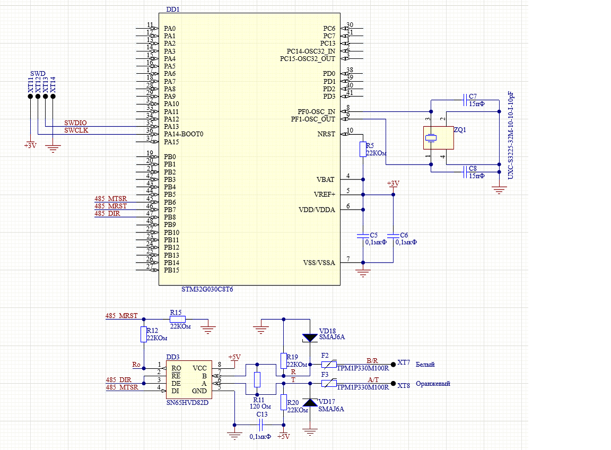

<h1 align="center">omnicomm_slave</h1>  

## Тестовое задание на программиста встраиваемого ПО
Необходимо реализовать часть протокола Omnicomm LLS (Slave - устройство):
-Команда 06h (Полная реализация ответа, в том числе CRC)
Данные для отправки можно сгенерировать любым образом.
Схема устройства приведена ниже.  
Параметры UART: скорость 19200, 1 старт бит, 1 стоп бит, без бита четности.

### Требования к результату:
- **БЕЗ ВНЕШНИХ ЗАВИСИМОСТЕЙ**, SDK использовать можно, HAL (нежелательно), LL (желательно), CMSIS. Тут речь про библиотеки, найденные в интернете.
- Реализация должна быть **НЕ БЛОКИРУЮЩЕЙ** (не останавливать ход программы, не использовать блокирующие функции)
- Код должен быть **ЛЕГКО ПЕРЕНОСИМЫМ** (основная логика должна быть отделена от низкоуровневых функций, а при смене микроконтроллера минимальное переписывание кода).
- Реализация LLS должна быть **ЛЕГКО РАСШИРЯЕМОЙ** (при необходимости легко добавляются новые команды, потенциально разной длины)
### Описание протокола 
Команда предназначена для чтения текущих данных: относительный уровень, температура, частота. Относительный уровень выдается датчиком в интервале, заданном параметрами "Минимальное показание", "Максимальное показание".
Данные передаются младшим байтом вперёд.
### Формат команды (Запрос):
|Смещение, байт|Размер поля, байт|Значение|Описание|
|-|-|-|-|
|0|1|31h|Префикс|
|+1|1|00h...FFh|Сетевой адрес получателя|
|+2|1|06h|Код операции|
|+3|1|00h...FFh|Контрольная сумма|

### Формат ответа:
|Смещение, байт|Размер поля, байт|Значение|Описание|
|-|-|-|-|
|0|1|3Eh|Префикс|
|+1|1|00h...FFh|Сетевой адрес отправителя|
|+2|1|06h|Код операции|
|+3|1|-128...127|Температура в градусах Цельсия|
|+4|2|0000h...FFFFh|Относительный уровень|
|+6|2|0000h...FFFFh|Значения частоты|
|+8|1|00h...FFh|Контрольная сумма|

### Метод расчета CRC (для одного байта):
```
U8 CRC8(U8 data, U8 crc)
{
    U8 i = data ^ crc;
    crc = 0;
    if(i & 0x01) crc ^= 0x5e;
    if(i & 0x02) crc ^= 0xbc;
    if(i & 0x04) crc ^= 0x61;
    if(i & 0x08) crc ^= 0xc2;
    if(i & 0x10) crc ^= 0x9d;
    if(i & 0x20) crc ^= 0x23;
    if(i & 0x40) crc ^= 0x46;
    if(i & 0x80) crc ^= 0x8c;
    return crc;
}
```
## Информация о проекта
Проект для микроконтроллера ***cs32f103c8_blue_pill***(Китайский аналог
***stm32f103c8_blue_pill***), начальная инициализация сгенерирована программой
**CubeMx**. Разработан на **IDE** ***CLion*** с использованием **Arm GNU Toolchain**
и **OpenOCD**.  
Проект можно запустить для ***stm32f103c8_blue_pill*** если заменить **cs32f103c8_blue_pill(stlink).cfg** 
на **stm32f103c8_blue_pill.cfg**.

 
