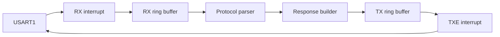
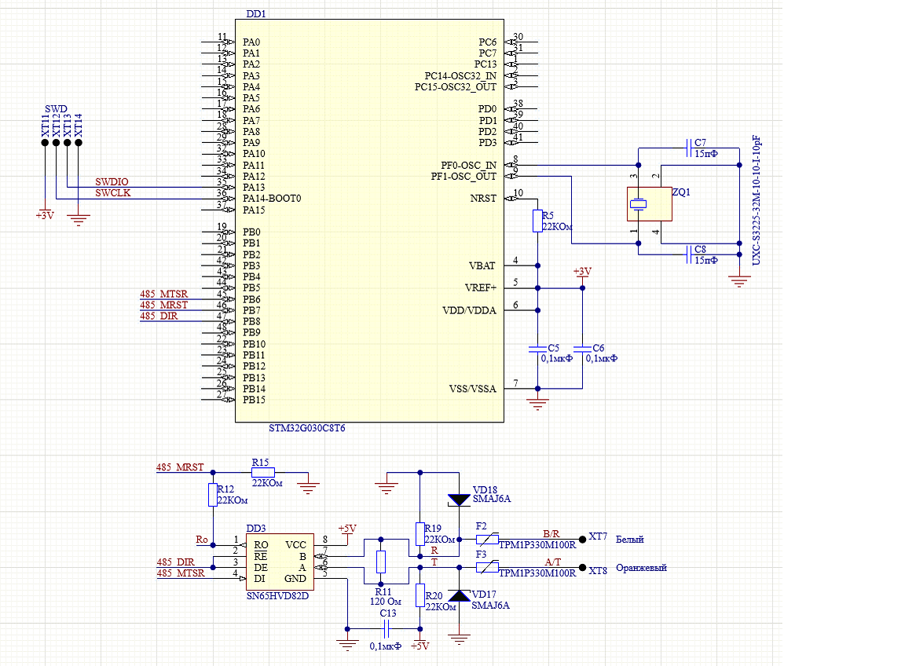

# Omnicomm LLS slave для STM32F103

[](https://github.com/AleksandrKajl/omnicomm_slave/actions/workflows/ci.yml)

Прошивка эмулирует ведомое устройство протокола Omnicomm LLS и отвечает на команду `0x06` текущими данными датчика. Проект предназначен для микроконтроллера STM32F103C8T6 или совместимого CS32F103C8T6 на плате Blue Pill.

Приём и передача UART выполняются по прерываниям. Полученные байты передаются в кольцевой SPSC-буфер, а поиск и проверка пакетов выполняются в основном цикле. Это отделяет обработчик прерывания от логики протокола и не требует динамического выделения памяти.


```mermaid
flowchart LR
    UART[USART1] --> RX_ISR[RX interrupt]
    RX_ISR --> RX_BUFFER[RX ring buffer]
    RX_BUFFER --> PARSER[Protocol parser]
    PARSER --> RESPONSE[Response builder]
    RESPONSE --> TX_BUFFER[TX ring buffer]
    TX_BUFFER --> TX_ISR[TXE interrupt]
    TX_ISR --> UART
```

## Возможности

- приём запросов Omnicomm LLS по USART1;
- проверка адреса устройства и CRC-8;
- обработка команды `0x06`;
- формирование ответа с температурой, уровнем и частотой;
- защита непрочитанных данных при переполнении RX-буфера;
- неблокирующая передача через очередь TX и прерывание TXE;
- подсчёт отброшенных байтов RX и сообщений TX;
- host-тесты CRC, кольцевого буфера и потокового parser;
- генерация файлов ELF, HEX, BIN и карты памяти.

## Аппаратная конфигурация

| Параметр | Значение |
|---|---|
| Микроконтроллер | STM32F103C8T6 / CS32F103C8T6 |
| Частота ядра | 72 МГц |
| Интерфейс | USART1 |
| TX | PA9 |
| RX | PA10 |
| Скорость | 19200 бод |
| Формат кадра | 8 бит, без чётности, 1 стоп-бит |

Схема подключения из исходного задания:



## Протокол

Устройство использует сетевой адрес `0x71`. Многобайтовые значения передаются младшим байтом вперёд.

Формат запроса:

| Смещение | Размер | Значение | Назначение |
|---:|---:|---:|---|
| 0 | 1 байт | `0x31` | Префикс запроса |
| 1 | 1 байт | `0x71` | Адрес устройства |
| 2 | 1 байт | `0x06` | Код команды |
| 3 | 1 байт | `0x00`–`0xFF` | CRC-8 |

Формат ответа на команду `0x06`:

| Смещение | Размер | Назначение |
|---:|---:|---|
| 0 | 1 байт | Префикс ответа `0x3E` |
| 1 | 1 байт | Адрес устройства `0x71` |
| 2 | 1 байт | Код команды `0x06` |
| 3 | 1 байт | Температура |
| 4 | 2 байта | Относительный уровень |
| 6 | 2 байта | Частота |
| 8 | 1 байт | CRC-8 |

Текущая реализация генерирует демонстрационные данные программно. Функцию `sensor_get_data()` можно заменить чтением реального датчика без изменения транспортного слоя и обработчика протокола.

## Структура проекта

```text
inc/                 заголовки прикладных модулей
inc/hardware/        заголовки аппаратного слоя
src/                 CRC, протокол, буферы и логика датчика
src/hardware/        настройка STM32 и работа с периферией
cmake/               toolchain, STM32 HAL и генерация артефактов
tests/               тесты, выполняемые на ПК
ocd/                 конфигурация OpenOCD
Drivers/             STM32CubeF1 HAL, LL и CMSIS
```

Ключевые модули:

- `transceiver` ищет запросы в потоке, проверяет CRC и формирует байты ответов без привязки к UART;
- `ring_buf` реализует статический SPSC-буфер для обмена между ISR и основным циклом;
- `uart` обслуживает приём и передачу USART1 через кольцевые буферы;
- `sensor` формирует демонстрационные показания;
- `crc` рассчитывает контрольную сумму пакета.

## Сборка прошивки

Необходимы CMake 3.20+, Ninja и Arm GNU Toolchain (`arm-none-eabi-*`), доступные через `PATH`.

```shell
cmake -S . -B build -G Ninja -DCMAKE_BUILD_TYPE=Release
cmake --build build
```

После сборки в каталоге `build` создаются:

- `omnicomm_slave.elf`;
- `omnicomm_slave.hex`;
- `omnicomm_slave.bin`;
- `omnicomm_slave.map`.

## Тесты

Тесты собираются системным C-компилятором и не требуют платы или ARM-toolchain.

```shell
cmake -S tests -B build/tests -G Ninja
cmake --build build/tests
ctest --test-dir build/tests --output-on-failure
```

Проверяются известные CRC-последовательности, работа кольцевого буфера и потоковый разбор запросов. Тесты parser охватывают получение пакета частями, мусор перед префиксом, неверные адрес и CRC, последовательные запросы и восстановление после повреждённого пакета.

Очереди RX и TX имеют по 256 ячеек, из которых одна всегда остаётся свободной. При заполнении RX новый байт отбрасывается, а при заполнении TX не ставится в очередь всё сообщение; соответствующие счётчики доступны через API модуля `uart`.

## Проверка

GitHub Actions проверяет host-тесты и Release-сборку прошивки при каждом push и pull request.

Последняя локальная проверка: 3 из 3 тестов пройдены; Release-сборка занимает 5764 байта FLASH (8,80 %) и 3016 байт RAM (14,73 %).

## Ограничения

- Данные датчика пока генерируются программно.
- DMA не используется: передача выполняется через прерывание TXE.
- При переполнении очереди TX ответ отбрасывается, а счётчик переполнений увеличивается.
- Работа на реальной плате и обмен с физическим устройством ещё не подтверждены.

## Происхождение кода

Прикладная логика, parser протокола, CRC, кольцевые буферы и UART-очереди находятся в `src/` и `inc/`. Каталог `Drivers/` содержит STM32CubeF1 HAL, LL и CMSIS от STMicroelectronics. Файлы startup, linker script и часть аппаратной инициализации основаны на шаблонах STM32CubeMX.

## Прошивка и отладка

В каталоге `ocd` находится конфигурация OpenOCD для платы CS32F103C8 Blue Pill и программатора ST-Link:

```shell
openocd -f "ocd/cs32f103c8_blue_pill(stlink).cfg"
```

Для оригинального STM32F103C8T6 потребуется подходящая конфигурация target для STM32F1.
